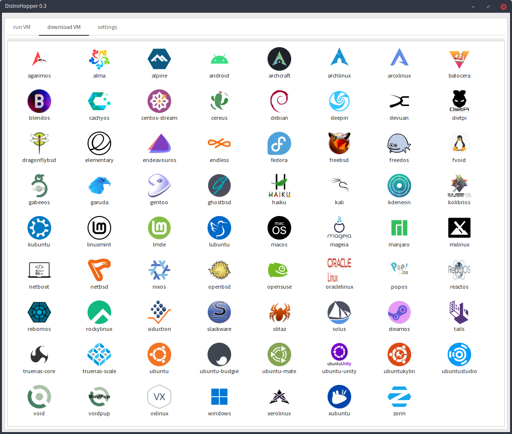

Want you try new Operating system? 

 How?

# [DistroHopper](https://github.com/oSoWoSo/DistroHopper)
Quickly download, create and run VM of any(TODO) operating system.

Licensed under AGPL3
### Still Testing version!

quickly create and run VMs

 As a base excellent [quickemu](https://github.com/quickemu-project/quickemu)

I added:

## quickgui
  using yad

### .Desktop file generator
  It will simple generate .desktop files for every supported VM in quickemu.
  So you can copy it anywhere...
  
  And I mean every supported distro.
  
  you can download new distro with few clicks of a mouse
  
  You need to run quickgui just for update supported distros.

### Simple GUI using yad --notebook

See it in action on youtube...

  or command line?...

## quicktui
  using fzf

# Why I creating this?
  Because I wanna learn

- Linux

- Bash

- yad

- project management

- contribute to open source

Because I wanna play with Quickemu

And easily add new distro to it

#

Quickemu.

## Requirements

-   [QEMU](https://www.qemu.org/) (*6.0.0 or newer*) **with GTK, SDL,
    SPICE & VirtFS support**
-   [bash](https://www.gnu.org/software/bash/) (*4.0 or newer*)
-   [Coreutils](https://www.gnu.org/software/coreutils/)
-   [EDK II](https://github.com/tianocore/edk2)
-   [grep](https://www.gnu.org/software/grep/)
-   [jq](https://stedolan.github.io/jq/)
-   [LSB](https://wiki.linuxfoundation.org/lsb/start)
-   [procps](https://gitlab.com/procps-ng/procps)
-   [python3](https://www.python.org/)
-   [macrecovery](https://github.com/acidanthera/OpenCorePkg/tree/master/Utilities/macrecovery)
-   [mkisofs](http://cdrtools.sourceforge.net/private/cdrecord.html)
-   [usbutils](https://github.com/gregkh/usbutils)
-   [util-linux](https://github.com/karelzak/util-linux)
-   [sed](https://www.gnu.org/software/sed/)
-   [socat](http://www.dest-unreach.org/socat/)
-   [spicy](https://gitlab.freedesktop.org/spice/spice-gtk)
-   [swtpm](https://github.com/stefanberger/swtpm)
-   [Wget](https://www.gnu.org/software/wget/)
-   [xdg-user-dirs](https://www.freedesktop.org/wiki/Software/xdg-user-dirs/)
-   [xrandr](https://gitlab.freedesktop.org/xorg/app/xrandr)
-   [zsync](http://zsync.moria.org.uk/)
-   [unzip](http://www.info-zip.org/UnZip.html)

### Installing Requirements

For Ubuntu, Arch and nixos systems the
[ppa](https://launchpad.net/~flexiondotorg/+archive/ubuntu/quickemu),
[AUR](https://aur.archlinux.org/packages/quickemu) or
[nix](https://github.com/NixOS/nixpkgs/tree/master/pkgs/development/quickemu)
packaging will take care of the dependencies. For other host
distributions or operating systems it will be necessary to install the
above requirements or their equivalents.

These examples may save a little typing

Debian:

    sudo apt install qemu bash coreutils ovmf grep jq lsb procps python3 genisoimage usbutils util-linux sed spice-client-gtk swtpm wget xdg-user-dirs zsync unzip

Fedora:

    sudo dnf install qemu bash coreutils edk2-tools grep jq lsb procps python3 genisoimage usbutils util-linux sed spice-gtk-tools swtpm wget xdg-user-dirs xrandr unzip
    
Void Linux:

    sudo xbps-install qemu bash coreutils grep jq procps-ng python3 util-linux sed spice-gtk swtpm usbutils wget xdg-user-dirs xrandr unzip zsync socat

# Currently supported Distribution:

In screenshot above...

### Testing version!

# Project chat group:
If anyone wanna join, here is one 
[SimpleX](https://simplex.chat/contact#/?v=1-2&smp=smp%3A%2F%2FSkIkI6EPd2D63F4xFKfHk7I1UGZVNn6k1QWZ5rcyr6w%3D%40smp9.simplex.im%2FzmtsZwfTjwyynibt0bF6bb_xLWS9ce5A%23%2F%3Fv%3D1-2%26dh%3DMCowBQYDK2VuAyEAkMtz66wGfWb6VDn-_t_mVm3RFiFfOC3Hxye8Hm5tmVo%253D%26srv%3Djssqzccmrcws6bhmn77vgmhfjmhwlyr3u7puw4erkyoosywgl67slqqd.onion&data=%7B%22type%22%3A%22group%22%2C%22groupLinkId%22%3A%22o8KR0TOM0f2j33nO9goMRQ%3D%3D%22%7D) way

(check the software! even if you don't want chat about DistroHopper)
[Simplex website](https://simplex.chat)

# Without these amazing projects it wouldn't be posible:

[bash](https://www.gnu.org/software/bash/)

[QEMU](https://www.qemu.org/)

[quickemu](https://github.com/quickemu-project/quickemu)

GUI depends on
[yad](https://github.com/v1cont/yad)

TUI depends on
[fzf](https://github.com/junegunn/fzf)
