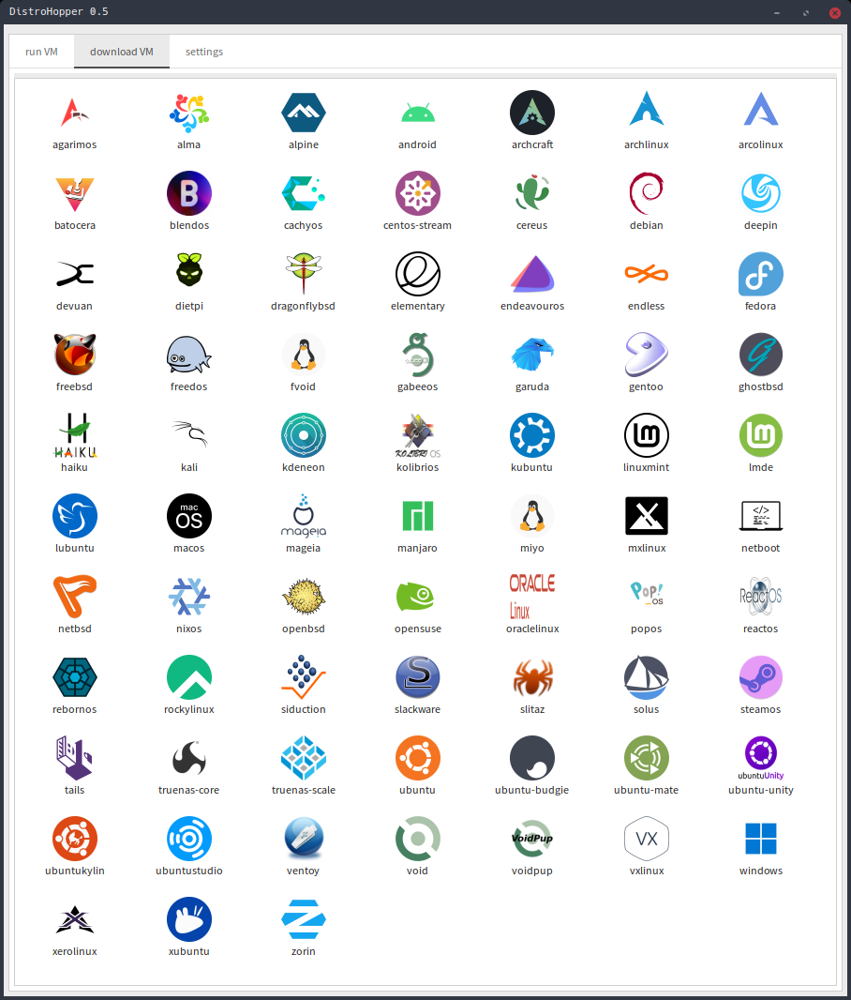

---

# Looking to try out a new operating system?

 try

# **DistroHopper**
Quickly download, create and run VM of any#TODO operating system.

Linux required...

---

Click on Hop for latest download

Licensed under AGPL3
# Still Beta version!

  
Click for screenshot

 As a base excellent [quickemu](https://github.com/quickemu-project/quickemu) (Link to project page)

  You can download new distro with **few clicks** of a mouse

# Features
 - GUI using yad (on youtube)

 - TUI using fzf (on youtube)

 - Desktop(shortcuts) entries generator

 - Set dir where VMs will be stored

 - Install DistroHopper systemwide

 - Portable mode (dependecies still must be installed)

 - Add new operating system to quickget (bit easier)

 - Copy all downloaded ISOs to destination directory

 - Translate DistroHopper (Currently supported English and Czech language)

Developed in English and translated into Czech language.

## Welcome translations!

---

# Why am I doing it?
  Because I wanna learn

- Linux

- Bash

- yad

- project management

And contribute to open source

 play with Quickemu

And easily add new distros to it

---

## How to run DistroHopper?

You need fullfill the requirement first...

## Requirements (For running VMs)
-   [QEMU](https://www.qemu.org/) (*6.0.0 or newer*) **with GTK, SDL, SPICE & VirtFS support**
-   [bash](https://www.gnu.org/software/bash/) (*4.0 or newer*)
-   [Coreutils](https://www.gnu.org/software/coreutils/)
-   [EDK II](https://github.com/tianocore/edk2)
-   [grep](https://www.gnu.org/software/grep/)
-   [jq](https://stedolan.github.io/jq/)
-   [LSB](https://wiki.linuxfoundation.org/lsb/start)
-   [procps](https://gitlab.com/procps-ng/procps)
-   [python3](https://www.python.org/)
-   [macrecovery](https://github.com/acidanthera/OpenCorePkg/tree/master/Utilities/macrecovery)
-   [mkisofs](http://cdrtools.sourceforge.net/private/cdrecord.html)
-   [usbutils](https://github.com/gregkh/usbutils)
-   [util-linux](https://github.com/karelzak/util-linux)
-   [sed](https://www.gnu.org/software/sed/)
-   [socat](http://www.dest-unreach.org/socat/)
-   [spicy](https://gitlab.freedesktop.org/spice/spice-gtk)
-   [swtpm](https://github.com/stefanberger/swtpm)
-   [Wget](https://www.gnu.org/software/wget/)
-   [xdg-user-dirs](https://www.freedesktop.org/wiki/Software/xdg-user-dirs/)
-   [xrandr](https://gitlab.freedesktop.org/xorg/app/xrandr)
-   [zsync](http://zsync.moria.org.uk/)
-   [unzip](http://www.info-zip.org/UnZip.html)

### Installing Requirements

For Ubuntu, Arch and nixos systems the
[ppa](https://launchpad.net/~flexiondotorg/+archive/ubuntu/quickemu),
[AUR](https://aur.archlinux.org/packages/quickemu) or
[nix](https://github.com/NixOS/nixpkgs/tree/master/pkgs/development/quickemu)
packaging will take care of the dependencies. For other host
distributions or operating systems it will be necessary to install the
above requirements or their equivalents.

	If you install DistroHopper, it should take care of dependencies on Arch, Debian, Ubuntu, openSuse and Fedora

### For DistroHopper to work you need

  `wget yad fzf`

 quickemu is included

 For adding new distros, or adding/improving translations you will need also meld.

# How to install DistroHopper?

 You need get copy of distrohopper

  If you want more stable experience, download latest release from

#### [GitHub](https://github.com/oSoWoSo/DistroHopper/releases) or SourceForge 

---

 If you want latest developer version... (could have bugs and break anytime)

 Or you want translate DistroHopper

 `git clone https://github.com/oSoWoSo/DistroHopper`

 Enter created/unpacked distrohopper directory

 Now you should be good to go...

---

# How to run DistroHopper

 Just run from terminal

 `./dh`

  And you will see what next...

  I am usually run DistroHopper as:

 `./dh m r s l && ./dh i && dh g`

 (But...)

## Desktop files

 All desktop files will be storred in your .config/distrohopper
 in directories *ready* and *supported*

 Fell free to copy them anywhere you want...

### Currently supported Operating Systems and tools:
agarimos
alma
alpine
android
arch
archcraft
arco
artix
athenaos
batocera
biglinux
blendos
bodhi
cachyos
centos-stream
cereus
chimera
debian
deepin
devuan
dietpi
dragonflybsd
edubuntu
elementary
endeavouros
endless
fedora
freebsd
freedos
fvoid
gabeeos
garuda
gentoo
ghostbsd
haiku
holoiso
kali
kdeneon
kolibrios
kubuntu
lite
lmde
mageia
manjaro
mint
miyo
mx
netboot
netbsd
nixos
lubuntu
macos
openbsd
openindiana
opensuse
oracle
popos
reactos
rebornos
rocky
siduction
slackware
slax
slitaz
solus
tails
tinycore
truenas-core
truenas-scale
tuxedoos
ubuntu
ubuntu-budgie
ubuntucinnamon
ubuntukylin
ubuntu-mate
ubuntu-server
ubuntustudio
ubuntu-unity
vanillaos
ventoy
void
voidpup
vx
windows
xero
xubuntu
zorin

Also with posible planned: [in discusion](https://github.com/oSoWoSo/DistroHopper/discussions/9)

---

#### [discuss](https://github.com/oSoWoSo/DistroHopper/discussions) on github

# Join DistroHopper chat group:
 (click SimpleX logo)

(check the software! even if you don't want chat about DistroHopper)
[Simplex website](https://simplex.chat)

# Without these amazing projects it wouldn't be posible:

#### [bash](https://www.gnu.org/software/bash/)

#### [QEMU](https://www.qemu.org/)

#### [quickemu](https://github.com/quickemu-project/quickemu)

GUI depends on
#### [yad](https://github.com/v1cont/yad)

TUI depends on
#### [fzf](https://github.com/junegunn/fzf)

----

For

- easy of use

#### [fish](https://fishshell.com)

- commiting and working with github

#### [lazygit](https://github.com/jesseduffield/lazygit)

#### [opencommit](https://github.com/di-sukharev/opencommit)

- Editing

#### [geany](https://geany.org/)

#### [Kate](https://apps.kde.org/kate)

- diff

#### [Meld](https://meld.app/)

- Logo and icons

#### [GIMP](https://www.gimp.org)

and

#### [Inkscape](https://inkscape.org)

#### [logo by](https://freesvg.org/by/OpenClipart) bit repaired by me..

- Updating translation

#### [Poedit](https://poeditor.com/)

Everything done on

#### [Void Linux](https://voidlinux.org)

---

# Mirrored on

#### [GitHub](https://github.com/oSoWoSo/DistroHopper)

#### [SourceForge](https://sourceforge.net/projects/distrohopper)

#### [Disroot](https://git.disroot.org/oSoWoSo/DistroHopper)

#### [Codeberg](https://codeberg.org/oSoWoSo/DistroHopper)

#### [GitLab](https://gitlab.com/osowoso/distrohopper)

#### [SourceHut](https://git.sr.ht/~osowoso/DistroHopper)

---

For Homepage click on Hop

# donate

@zen0bit at github

mailto: <zenobit@osowoso.xyz>

#### parent site [oSoWoSo](https://osowoso.xyz)

