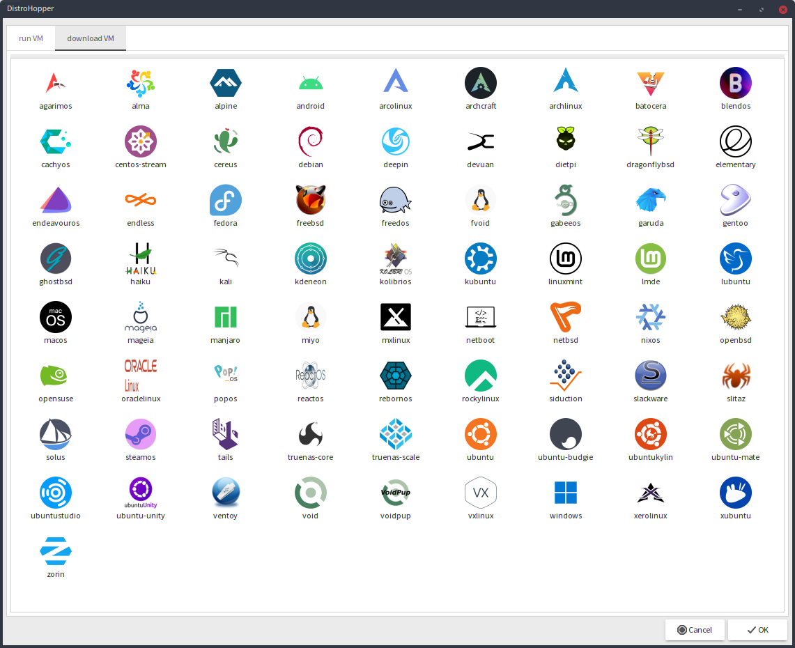

Looking to try out a new operating system?

 try

# **DistroHopper**

Quickly download, create and run VM of any#TODO operating system.

Licensed under AGPL3
# Still Testing version!

quickly create and run VMs

 As a base excellent [quickemu](https://github.com/quickemu-project/quickemu)
  
  you can download new distro with few clicks of a mouse
  
## GUI using yad

See it in action on youtube...

<iframe width="720" height="480" src="https://www.youtube-nocookie.com/embed/JtjIseqZMkQ" title="YouTube video player" frameborder="0" allow="accelerometer; autoplay; clipboard-write; encrypted-media; gyroscope; picture-in-picture; web-share" allowfullscreen></iframe>

  or command line?...

## TUI using fzf

<iframe width="720" height="480" src="https://www.youtube-nocookie.com/embed/gJ5hqYEskOw" title="YouTube video player" frameborder="0" allow="accelerometer; autoplay; clipboard-write; encrypted-media; gyroscope; picture-in-picture; web-share" allowfullscreen></iframe>

## .Desktop file generator
  It will simple generate .desktop files for every supported and downloaded VM in quickemu.
  So you can link it anywhere...

---

# Why am I doing it?
  Because I wanna learn

- Linux

- Bash

- yad

- project management

And contribute to open source

 play with Quickemu

And easily add new distros to it

---

## How to run DistroHopper?

You need fullfill the requirement first...

Quickemu.

<iframe width="720" height="480" src="https://www.youtube-nocookie.com/embed/AOTYWEgw0hI" title="YouTube video player" frameborder="0" allow="accelerometer; autoplay; clipboard-write; encrypted-media; gyroscope; picture-in-picture; web-share" allowfullscreen></iframe>

## Requirements (For running VMs)

-   [QEMU](https://www.qemu.org/) (*6.0.0 or newer*) **with GTK, SDL,
    SPICE & VirtFS support**
-   [bash](https://www.gnu.org/software/bash/) (*4.0 or newer*)
-   [Coreutils](https://www.gnu.org/software/coreutils/)
-   [EDK II](https://github.com/tianocore/edk2)
-   [grep](https://www.gnu.org/software/grep/)
-   [jq](https://stedolan.github.io/jq/)
-   [LSB](https://wiki.linuxfoundation.org/lsb/start)
-   [procps](https://gitlab.com/procps-ng/procps)
-   [python3](https://www.python.org/)
-   [macrecovery](https://github.com/acidanthera/OpenCorePkg/tree/master/Utilities/macrecovery)
-   [mkisofs](http://cdrtools.sourceforge.net/private/cdrecord.html)
-   [usbutils](https://github.com/gregkh/usbutils)
-   [util-linux](https://github.com/karelzak/util-linux)
-   [sed](https://www.gnu.org/software/sed/)
-   [socat](http://www.dest-unreach.org/socat/)
-   [spicy](https://gitlab.freedesktop.org/spice/spice-gtk)
-   [swtpm](https://github.com/stefanberger/swtpm)
-   [Wget](https://www.gnu.org/software/wget/)
-   [xdg-user-dirs](https://www.freedesktop.org/wiki/Software/xdg-user-dirs/)
-   [xrandr](https://gitlab.freedesktop.org/xorg/app/xrandr)
-   [zsync](http://zsync.moria.org.uk/)
-   [unzip](http://www.info-zip.org/UnZip.html)

### Installing Requirements

For Ubuntu, Arch and nixos systems the
[ppa](https://launchpad.net/~flexiondotorg/+archive/ubuntu/quickemu),
[AUR](https://aur.archlinux.org/packages/quickemu) or
[nix](https://github.com/NixOS/nixpkgs/tree/master/pkgs/development/quickemu)
packaging will take care of the dependencies. For other host
distributions or operating systems it will be necessary to install the
above requirements or their equivalents.

These examples may save a little typing

Debian:

    sudo apt install qemu bash coreutils ovmf grep jq lsb procps python3 genisoimage usbutils util-linux sed spice-client-gtk swtpm wget xdg-user-dirs zsync unzip

Fedora:

    sudo dnf install qemu bash coreutils edk2-tools grep jq lsb procps python3 genisoimage usbutils util-linux sed spice-gtk-tools swtpm wget xdg-user-dirs xrandr unzip
    
Void Linux:

    sudo xbps-install qemu bash coreutils grep jq procps-ng python3 util-linux sed spice-gtk swtpm usbutils wget xdg-user-dirs xrandr unzip zsync socat

### For DistroHopper to work you need

  `wget yad fzf` quickemu is included

# How to install DistroHopper?

 You need get copy of distrohopper
 
  If you want more stable experience, download latest release from
  
#### [GitHub](https://github.com/oSoWoSo/DistroHopper/releases)
  
  or
  
  From SourceForge 
 
 If you want latest developer version... (could have bugs)
 
 `git clone https://github.com/oSoWoSo/DistroHopper`
 
 Enter created/unpacked distrohopper directory
 
 Then enter config directory
 
 `cd distrohopper/config`
 
 And run
 
 `./1stRun.sh`
 
 Now should be good to go...

---

# How to run DistroHopper

 Just run from terminal
 
 `dh`
 
 or for TUI version (Download and run from/into same directory)
 
 `dh -t`
 
## Desktop files

 All desktop files will be storred in your .config
 in directories /distrohopper/ready and supported
 
 Fell free to link them anywhere you want...
 
 

### Currently supported Distribution:

In screenshot above...

---

# Github discussion:

#### [discuss](https://github.com/oSoWoSo/DistroHopper/discussions)

# Project chat group:
If anyone wanna join, here is one 
 way

(check the software! even if you don't want chat about DistroHopper)
[Simplex website](https://simplex.chat)

# Without these amazing projects it wouldn't be posible:

#### [bash](https://www.gnu.org/software/bash/)

#### [QEMU](https://www.qemu.org/)

#### [quickemu](https://github.com/quickemu-project/quickemu)

GUI depends on
#### [yad](https://github.com/v1cont/yad)

TUI depends on
#### [fzf](https://github.com/junegunn/fzf)

----

For 

- easy of use

#### [fish](https://fishshell.com)

- commiting and working with github

#### [lazygit](https://github.com/jesseduffield/lazygit)

- Editing

#### [geany](https://geany.org/)

#### [Kate](https://apps.kde.org/kate)

- diff

#### [Meld](https://meld.app/)

- Logo and icons

#### [GIMP](https://www.gimp.org)

and

#### [Inkscape](https://inkscape.org)

#### [logo by](https://freesvg.org/by/OpenClipart) bit repaired by me..

Everything done on

#### [Void Linux](https://voidlinux.org)

---

# Mirrored on

#### [GitHub](https://github.com/oSoWoSo/DistroHopper)

#### [SourceForge](https://sourceforge.net/projects/distrohopper)

#### [Disroot](https://git.disroot.org/oSoWoSo/DistroHopper)

#### [Codeberg](https://codeberg.org/oSoWoSo/DistroHopper)

#### [GitLab](https://gitlab.com/osowoso/distrohopper)

#### [SourceHut](https://git.sr.ht/~osowoso/DistroHopper)

---

# DistroHopper website (click mascot):

# donate

@zen0bit at github

mailto: <zenobit@osowoso.xyz>

[up](./)

#### parent site [oSoWoSo](https://osowoso.xyz)

